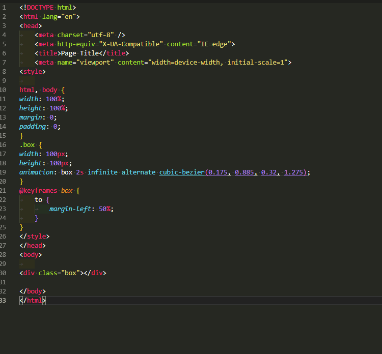

## IDENTAÇÃO
basicamente 'indentar' é um termo ultilizado para escrever o codigo do programa de forma hierarquica, facilitando assim visualização e o entendimento do programa

* Exemplo: sem e com identação

